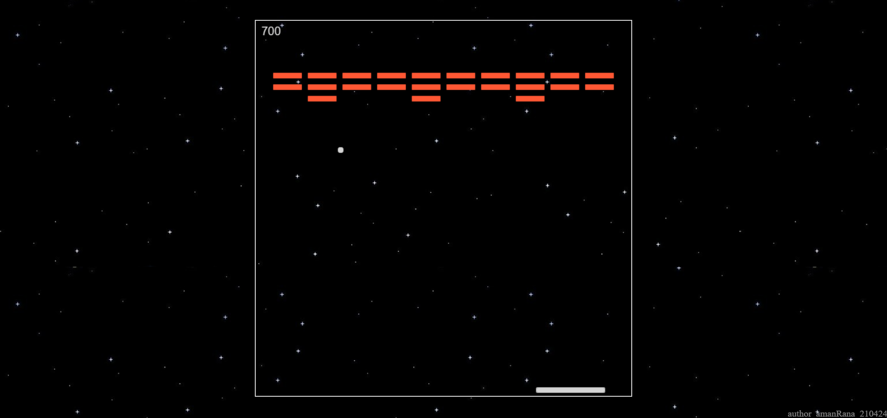

# Brick Breaker

Brick Breaker is a classic arcade-style game where players control a paddle to bounce a ball and break bricks. The goal is to clear all the bricks while keeping the ball in play. This game is built using **HTML, CSS, and JavaScript**.
  
## 🎮 Live Demo
Play the game online here: [Brick Breaker](https://amanranahere.github.io/Brick-Breaker/)

  

## 🕹️ How to Play
- Use the **left** and **right** arrow keys to move the paddle.
- Bounce the ball off the paddle to break bricks.
- The game ends if the ball **touches the lower surface of the board**.
- Clear all the bricks to advance to the next level.
- Press **Spacebar** to restart the game if it's over.
  
  

## ✨ Features
- **Classic Gameplay**: Inspired by the timeless arcade Brick Breaker game.
- **Progressive Difficulty**: More brick rows are added as levels increase.
- **Responsive Design**: Works across different screen sizes.
- **Score Tracking**: Points increase as you break bricks.
- **Smooth Animations**: Using the HTML5 Canvas element for a seamless experience.

  

## 🛠️ Built With
- **HTML5** - Structure and layout of the game.
- **CSS3** - Styling and design.
- **JavaScript** - Game logic, physics, and interactions.

  

## 🏗️ The Making Of
I built this project as a fun way to practice working with the **HTML5 Canvas element** in JavaScript. One of the key things I learned was handling **collision detection**, ensuring that the ball interacts correctly with bricks, the paddle, and the screen boundaries.  

Another interesting aspect was managing **game physics**, like the ball’s movement and how it bounces off different surfaces. I also implemented **progressive difficulty**, where more rows of bricks are added as the player advances.  

This project really helped me improve my understanding of **game loops**, **event handling**, and working with **2D graphics** in JavaScript. It was a great way to apply my knowledge while creating something interactive and enjoyable.

  

## 🖼️ Screenshot

